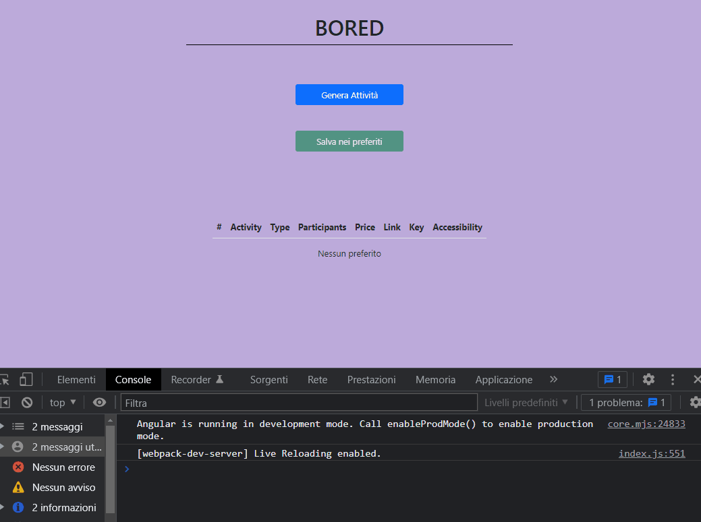

# Bored

Didactic code useful for my first experiments with Angular 13, Typescript, HttpClientModule, reactive programming and rxjs.

Setup:

after cloning run `npm i` then once inside the folder type `ng serve -o`.

